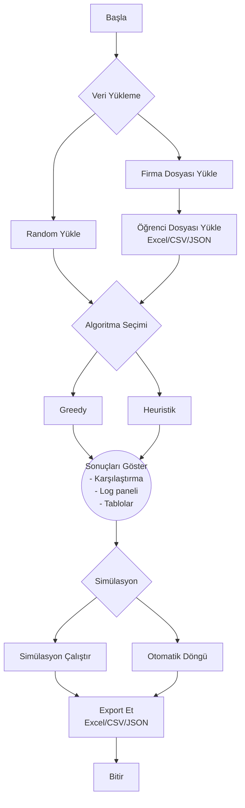

# Staj Eşleştirme Sistemi

Bu proje, öğrencileri staj firmalarına tercihlerine ve akademik performanslarına göre optimal bir şekilde yerleştiren kapsamlı bir eşleştirme sistemidir. İki farklı algoritma (Greedy ve Heuristik) kullanarak eşleştirme yapar ve sonuçları karşılaştırır. Python Programlama dersi grup ödevidir. [Koray GARİP](https://github.com/korayga) ile birlikte geliştirilmiştir

## Proje Özellikleri

### Temel Özellikler
- **Çoklu dosya formatı desteği**: Excel (.xlsx), CSV (.csv), JSON (.json)
- **İki algoritma**: Greedy (hızlı) ve Heuristik (optimum)
- **Gerçek zamanlı karşılaştırma**: Performans, memnuniyet, süre analizi
- **Simülasyon sistemi**: Reject simülasyonu ve otomatik döngüler
- **Test veri üretimi**: Rastgele firma ve öğrenci verileri
- **Kapsamlı export**: Sonuçları farklı formatlarda dışa aktarma
- **Profesyonel GUI**: Kullanıcı dostu tkinter arayüzü

### Teknik Özellikler
- **SQLite veritabanı**: Hafif ve taşınabilir veri saklama
- **Modüler mimari**: Temiz kod ve bakım kolaylığı
- **Kapsamlı validasyon**: Veri bütünlüğü kontrolü
- **Hata yönetimi**: Robust exception handling
- **Performans takibi**: İşlem sayısı, süre ve memnuniyet metrikleri

## Sistem Gereksinimleri

### Python Bağımlılıkları
```
pandas>=1.3.0
tkinter (Python ile birlikte gelir)
tksheet>=6.0.0
sqlite3 (Python ile birlikte gelir)
```

### Kurulum
```bash
pip install pandas tksheet
```

## Proje Yapısı

```
staj-eslestirme/
├── main.py                 # Ana başlatıcı
├── gui.py                  # Kullanıcı arayüzü
├── connection.py           # Veritabanı bağlantısı
├── databaseCreater.py      # Tablo oluşturma
├── database_info.py        # Tablo görüntüleme
├── ImportService.py        # Veri içe aktarma
├── ExportService.py        # Veri dışa aktarma
├── RandomDataGenerator.py  # Test veri üretimi
├── greedy.py               # Açgözlü algoritma
├── heuristik.py            # Sezgisel algoritma
├── simulation.py           # Simülasyon yöneticisi
├── classification.py       # Veri dönüştürme
├── siniflar.py             # Veri modelleri
└── db.db                   # SQLite veritabanı (otomatik oluşur)
```

## Veritabanı Şeması

### Firmalar Tablosu
| Alan | Tip | Açıklama |
|------|-----|----------|
| id | INTEGER | Benzersiz firma kimliği |
| firma_adi | TEXT | Firma adı |
| kontenjan | INTEGER | Toplam stajyer kontenjanı |
| min_ort | REAL | Minimum GPA şartı (0-4 arası) |
| kalan_kontenjan | INTEGER | Yerleştirme sonrası kalan yer |

### Öğrenciler Tablosu
| Alan | Tip | Açıklama |
|------|-----|----------|
| id | INTEGER | Benzersiz öğrenci kimliği |
| ogrenci_adi | TEXT | Öğrenci adı soyadı |
| ort | REAL | GPA (0-4 arası) |
| tercihler | TEXT | Virgülle ayrılmış firma ID'leri |
| yerlesen_firma_id | INTEGER | Yerleştiği firma (NULL=yerleşemedi) |
| durum | TEXT | 'Yerlestirildi' veya 'Yerlesemedi' |

## Algoritma Detayları

### Greedy Algoritması
**Yaklaşım**: Açgözlü, ilk uygun seçim
- Öğrencileri GPA'ya göre sıralar (yüksekten düşüğe)
- Her öğrenci için tercih sırasıyla firmaları dener
- İlk uygun firmaya yerleştirir (hızlı ama optimal olmayabilir)

**Avantajları**:
- Çok hızlı çalışır
- Basit ve anlaşılabilir
- Düşük işlem maliyeti

**Dezavantajları**:
- Optimal çözümü garanti etmez
- İlk bulduğuna yerleştirdiği için global optimum kaçırabilir

### Heuristik Algoritması
**Yaklaşım**: Skor tabanlı optimizasyon
- Her öğrenci-firma çifti için uygunluk skoru hesaplar
- En yüksek skorlu eşleştirmeyi seçer

**Skor Hesaplama Formülü**:
```
Skor = (GPA × 25) + (60 - tercih_sırası × 10) - |firma_min_ort - öğrenci_ort| × 5
```

**Skor Bileşenleri**:
- **GPA Bonusu**: Yüksek not = +25 puana kadar bonus
- **Tercih Bonusu**: 1. tercih = +50, 2. tercih = +40, 3. tercih = +30...
- **Uyum Cezası**: GPA farkının 5 katı kadar ceza

**Avantajları**:
- Daha optimal sonuçlar
- Çoklu faktör değerlendirmesi
- Yüksek memnuniyet skorları

**Dezavantajları**:
- Daha fazla hesaplama gerektirir
- Karmaşık skor sistemi

## Akış Şeması



## Kullanım Kılavuzu

### 1. Projeyi Başlatma
```bash
python main.py
```

### 2. Veri Yükleme
**Seçenek 1: Dosyadan Yükleme**
- "Firmalar Dosyası Seç" butonuna tıklayın
- Excel/CSV/JSON formatında firma dosyasını seçin
- "Öğrenciler Dosyası Seç" butonuna tıklayın
- Excel/CSV/JSON formatında öğrenci dosyasını seçin

**Seçenek 2: Random Veri**
- "Random Veri" butonuna tıklayın
- Sistem otomatik olarak test verisi oluşturur

### 3. Algoritma Çalıştırma
- "Greedy Algoritması" veya "Heuristik Algoritması" butonuna tıklayın
- Karşılaştırma panelinde sonuçları görün

### 4. Simülasyon İşlemleri
- **Reject Simülasyonu**: Firmalar öğrencileri rastgele reddeder
- **Min Ort Düşür**: Firma şartlarını %10 gevşetir
- **Otomatik Döngü**: Sürekli simülasyon çalıştırır

### 5. Sonuçları Export Etme
- "Export Et" butonuna tıklayın
- Format seçin (Excel/CSV/JSON)
- Yerleşenler veya yerleşemeyenler seçin
- Dosya konumunu belirtin

## Dosya Format Örnekleri

### Firmalar Dosyası
```csv
id,firma_adi,kontenjan,min_ort
1,TechCorp,5,3.0
2,DataSoft,3,2.8
3,CloudWorks,4,3.2
```

### Öğrenciler Dosyası
```csv
id,ogrenci_adi,ort,tercihler
1,Ahmet Yılmaz,3.5,"1,2,3"
2,Ayşe Demir,3.8,"2,1,3"
3,Mehmet Kaya,2.9,"3,2,1"
```

## Performans Metrikleri

### Karşılaştırma Kriterleri
1. **İşlem Sayısı**: Algoritmanın yaptığı toplam döngü adedi
2. **Çalışma Süresi**: Milisaniye cinsinden execution time
3. **Memnuniyet Skoru**: Öğrencilerin tercih sırasına göre hesaplanan puan
4. **Tur Sayısı**: Kümülatif çalışma adedi

### Memnuniyet Skoru Hesaplama
```
Her yerleşen öğrenci için:
Skor = max(0, 110 - tercih_sırası × 10)
```
- 1. tercih = 100 puan
- 2. tercih = 90 puan
- 3. tercih = 80 puan
- ...

## Simülasyon Özellikleri

### Reject Simülasyonu
- Her firmadan rastgele sayıda öğrenci reddedilir
- Reddedilen öğrenciler "Yerleşemedi" durumuna geçer
- Firma kontenjanları geri yüklenir
- Detaylı log raporu oluşturulur

### Otomatik Döngü
1. Seçilen algoritmayı çalıştır
2. Reject simülasyonu yap
3. Firma şartlarını %10 gevşet
4. 3 tur aynı sonuç çıkarsa dur
5. Maximum 50 tur koruması

## Hata Yönetimi ve Validasyon

### Dosya Validasyonu
- **Format kontrolü**: Desteklenen uzantılar
- **Boş dosya kontrolü**: İçerik var mı?
- **Kolon kontrolü**: Gerekli alanlar mevcut mu?
- **Veri tipi kontrolü**: Sayısal alanlar doğru mu?
- **Referans kontrolü**: Öğrenci tercihlerindeki firma ID'leri var mı?
- **Duplicate kontrolü**: Tekrar eden ID'ler var mı?

### Veri Aralık Kontrolleri
- **GPA aralığı**: 0.0 - 4.0 arası
- **Kontenjan**: Pozitif sayı
- **Tercihler**: Virgülle ayrılmış geçerli firma ID'leri

## Geliştirme ve Katkı

### Kod Stili
- Python PEP 8 standartlarına uygun
- Anlaşılabilir değişken isimleri (Türkçe)
- Kapsamlı yorum satırları
- Modüler fonksiyon yapısı

### Yeni Algoritma Ekleme
1. `greedy.py` veya `heuristik.py` dosyalarını örnek alın
2. `yerlestir()` metodunu implement edin
3. `islem_sayisi` ve `calisma_suresi` attributelerini ekleyin
4. GUI'de yeni buton ekleyin

### Test Verisi Genişletme
- `RandomDataGenerator.py` dosyasındaki `firma_isimleri` ve `isimler` listelerini güncelleyin
- Yeni sektörler ve isim grupları ekleyebilirsiniz


